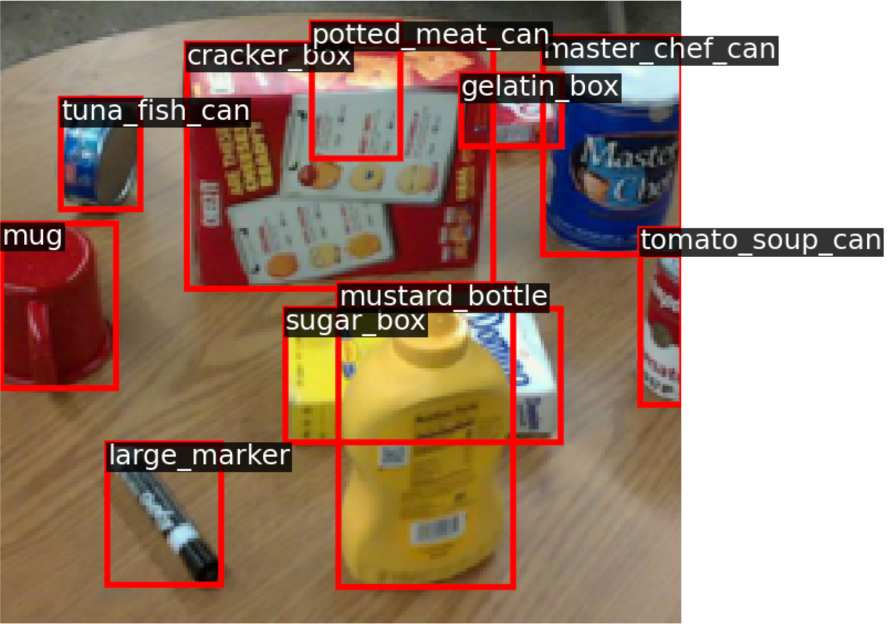
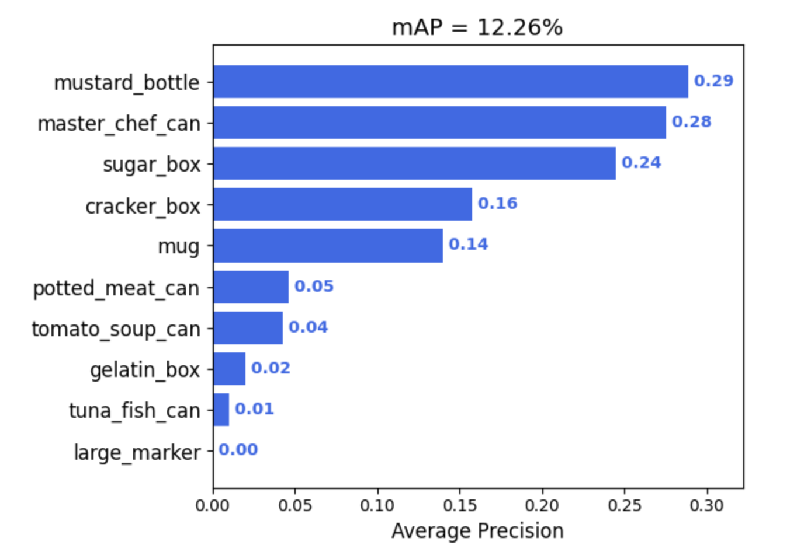

# Two Stage Object Detector

A two-stage object detector, based on Faster R-CNN, which consists of two modules - Region Proposal Networks (RPN) and Fast R-CNN. Trained to detect a set of object classes and evaluate the detection accuracy using the classic metric mean Average Precision (mAP).

  

# Contents

[***Objective***](https://github.com/leob03/2Stage_Object_Detector#objective)

[***Overview***](https://github.com/leob03/2Stage_Object_Detector#overview)

[***Dependencies***](https://github.com/leob03/2Stage_Object_Detector#dependencies)

[***Getting started***](https://github.com/leob03/2Stage_Object_Detector#getting-started)

[***Deeper dive into the code***](https://github.com/leob03/2Stage_Object_Detector#deeper-dive-into-the-code)

[***Results***](https://github.com/leob03/2Stage_Object_Detector#results)

# Objective

**  To achieve fast and accurate object detection in images by combining region proposal generation and object detection within a single neural network architecture.**

In this project, we implemented a **two-stage** object detector, based on [Faster R-CNN](https://arxiv.org/pdf/1506.01497.pdf), which consists of two modules - Region Proposal Networks (RPN) and Fast R-CNN.

We trained it to detect a set of object classes and evaluate the detection accuracy using the classic metric mean Average Precision ([mAP](https://github.com/Cartucho/mAP)).

  

  
# Overview

This architecture is designed to take an RGB color image as input and produce a [6 degrees-of-freedom pose](https://en.wikipedia.org/wiki/Six_degrees_of_freedom) estimate for each instance of an object within the scene from which the image was taken. To do this, PoseCNN uses 5 operations within the architecture descried in the next pipeline:

- First, a backbone convolutional **feature extraction** network is used to produce a tensor representing learned features from the input image.
- Second, the extracted features are processed by an **embedding branch** to reduce the spatial resolution and memory overhead for downstream layers.
- Third, an **instance segmentation branch** uses the embedded features to identify regions in the image corresponding to each object instance (regions of interest).
- Fourth, the translations for each object instance are estimated using a **translation branch** along with the embedded features.
- Finally, a **rotation branch** uses the embedded features to estimate a rotation, in the form of a [quaternion](https://en.wikipedia.org/wiki/Quaternions_and_spatial_rotation), for each region of interest.

The architecture is shown in more detail from Figure 2 of the [PoseCNN paper](https://arxiv.org/abs/1711.00199):

Now, we will implement a variant of this architecture that performs each of the 5 operations using PyTorch and data from our `PROPSPoseDataset`.

# Dependencies
**Python 3.10**, modern version of **PyTorch**, **numpy** and **scipy** module. Most of these are okay to install with **pip**. To install all dependencies at once, run the command `pip install -r requirements.txt`

I only tested this code with Ubuntu 20.04, but I tried to make it as generic as possible (e.g. use of **os** module for file system interactions etc. So it might work on Windows and Mac relatively easily.)

# Getting started

1. **Get the code.** `$ git clone` the repo and install the Python dependencies
2. **Train the models.** Run the training `$ train.py` and wait. You'll see that the learning code writes checkpoints into `rcnn_detector.pth` and periodically print its status. 
3. **Evaluate the models checkpoints and Visualize the predictions.** To evaluate a checkpoint run the scripts `$ python test.py` and pass it the path to a checkpoint (by modifying the checkpoint in the code, default: rcnn_detector.pth).

# Deeper dive into the code

### PROPS Detection Dataset

In order to train and evaluate object detection models, we needed a dataset where each image is annotated with a *set* of *bounding boxes*, where each box gives the category label and spatial extent of some object in the image.

We will use the [PROPS Detection](https://deeprob.org/datasets/props-detection/) dataset, which provides annotations of this form. This dataset is inspired in part on the [PASCAL VOC](http://host.robots.ox.ac.uk/pascal/VOC/) dataset, which ran a series of yearly computer vision competitions from 2005 to 2012, predating the ImageNet challenge which we have discussed in class.
The data from the 2007 challenge used to be one of the most popular datasets for evaluating object detection.
Our PROPS Detection dataset is much smaller than more recent object detection datasets such as [COCO](http://cocodataset.org/#home), and thus easier to manage.
PROPS comprises annotated bounding boxes for 10 object classes:
`["master_chef_can", "cracker_box", "sugar_box", "tomato_soup_can", "mustard_bottle", "tuna_fish_can", "gelatin_box", "potted_meat_can", "mug", "large_marker"]`.
The choice of these objects is inspired by the [YCB object and Model set](https://ieeexplore.ieee.org/document/7251504) commonly used in robotic perception models.

We create a [`PyTorch Dataset`](https://pytorch.org/docs/stable/data.html#torch.utils.data.Dataset) class
named `PROPSDetectionDataset` in `func.py` that will download the PROPS Detection dataset.
This class returns annotations for each image as a nested set of dictionary objects.

### Backbone and Feature Pyramid Network

The backbone and FPN of our detector is the core component that takes in an image and outputs features of different scales. It can be any type of convolutional network that progressively downsamples the image (e.g. via intermediate max pooling).

Here, we used a small [RegNetX-400MF](https://pytorch.org/vision/stable/models.html#torchvision.models.regnet_x_400mf) as the backbone so we can train in reasonable time on Colab. We implemented the minimal logic to initialize this backbone from pre-trained ImageNet weights and extract intermediate features `(c3, c4, c5)`.
These features `(c3, c4, c5)` have height and width that is ${1/8}^{th}$, ${1/16}^{th}$, and ${1/32}^{th}$ of the input image respectively.
These values `(8, 16, 32)` are called the "stride" of these features.
In other words, it means that moving one location on the FPN level is equivalent to moving `stride` pixels in the input image.

FPN will convert these `(c3, c4, c5)` multi-scale features to `(p3, p4, p5)`. These notations "p3", "p4", "p5" are called _FPN levels_.

### Faster R-CNN first stage: Region Proposal Network (RPN)

The first-stage of Faster R-CNN comprises a **Region Proposal Network (RPN)** that learns to predict general _object proposals_, which will then be used by the second stage to make final predictions.

**RPN prediction:** An input image is passed through the backbone and we obtain its FPN feature maps `(p3, p4, p5)`.
The RPN predicts multiple values at _every location on FPN features_. Faster R-CNN is _anchor-based_ — the model assumes that every location has multiple pre-defined boxes (called "anchors") and it predicts two measures per anchor, per FPN location:

1. **Objectness:** The likelihood of having _any_ object inside the anchor. This is _class-agnostic_: it only performs binary foreground/background classification.
2. **Box regression deltas:** 4-D "deltas" that _transform_ an anchor at that location to a ground-truth box.

**SIDE NOTE:** We used the more common practice of predicting `k` logits and use a logistic regressor instead of `2k` scores (and 2-way softmax) as shown in the above Figure. This slightly reduces the number of trainable parameters.

### Assigning a GT target to every model anchor

Faster R-CNN makes predictions at every anchor.
We need to assign a GT target for each anchor during training. So we can view this problem as assigning GT boxes (and their class labels) to every FPN feature map location.

GT boxes are available as 5D vectors `(x1, y1, x2, y2, C)` where `(x1, y1)` is the top-left co-ordinate and `(x2, y2)` is the bottom-right co-ordinate of the bounding box, and `C` is its object class label. These co-ordinates are absolute and real-valued in image dimensions. We first represented every location on an FPN level with `(xc, yc)` absolute and real-valued co-ordinates of a point on the image, that are centers of the receptive fields of those features.

For example, given features from FPN level having shape `(batch_size, channels, H / stride, W / stride)` and the location `feature[:, :, i, j]` maped to the image pixel `(stride * (i + 0.5), stride * (j + 0.5))` - 0.5 indicates the shift from top-left corner to the center of "stride box".

### Anchor-based Training of RPN

After having implemented this RPN head, the goal was to have it predict _high objectness_ and _accurate box deltas_ for anchors that are likely to contain objects.
We needed to assign a target GT box to every RPN prediction for training supervision.

**Faster R-CNN is anchor-based:** instead of _all possible locations_, it makes predictions with reference to some pre-defined _anchor boxes_, and matches each anchor with a single GT box if they have a high enough Intersection-over-Union (IoU).

Hence, we performed the following steps:

1. **Anchor generation:** Generated a set of anchors for every location in FPN feature map.
2. **Anchor to GT matching:** Matched these anchors with GT boxes based on their IoU-overlap.
3. **Format of box deltas:** Implemented the tranformation functions to obtain _box deltas_ from GT boxes (model training supervision) and applied deltas to anchors (final proposal boxes for second stage).

#### Anchor Generation

After having implemented a function to get the absolute image co-ordinates of FPN feature map locations — in `get_fpn_location_coords` We needed to form multiple anchor boxes centered at these locations.
RPN defines square anchor boxes of size `scale * stride` at every location, where `stride` is the FPN level stride, and `scale` is a hyperparameter.
For example, anchor boxes for P5 level (`stride = 32`), with `scale = 2` will be boxes of `(64 x 64)` pixels.
RPN also considers anchors of different aspect ratios, apart from square anchor boxes —

### Matching anchor boxes with GT boxes

Then we matched these generated anchors with GT boxes. Faster R-CNN matches some `N` anchor boxes with `M` GT boxes by applying a simple rule:

> Anchor box $N_i$ is matched with box $M_i$ if it has an IoU overlap higher than 0.6 with that box. For multiple such GT boxes, the anchor is assigned with the GT box that has the highest IoU. Note that a single ground-truth box may assign positive labels to multiple anchors.

Anchor boxes with `IoU < 0.3` with ALL GT boxes is assigned background GT box `(-1, -1, -1, -1, -1)`. All other anchors with IoU between `(0.3, 0.6)` are considered "neutral" and ignored during training. It is worth noting that the "neutral" Faster R-CNN anchors cause wasted computation, and removing this redundancy would overly complicate our implementation.

### GT Targets for box regression

Finally, the third and final component needed to train our RPN — we defined transformation functions for box regression deltas.

1. `rcnn_get_deltas_from_anchors`: Accepts anchor boxes and GT boxes, and returns deltas. Required for training supervision.
2. `rcnn_apply_deltas_to_anchors`: Accepts predicted deltas and anchor boxes, and returns predicted boxes. Required during inference.

### Faster R-CNN

At this point we have implemented the first half of Faster R-CNN, i.e., RPN, which is class-agnostic. Here, we briefly describe the second half Fast R-CNN.

Given a set of proposal boxes from RPN (per FPN level, per image),
we warp each region from the correspondng map to a fixed size 7x7 by using [RoI Align](https://arxiv.org/pdf/1703.06870.pdf).
We will use the `roi_align` function from `torchvision`. For usage instructions, see https://pytorch.org/docs/stable/torchvision/ops.html#torchvision.ops.roi_align

For simplicity and computational constraints,
our two-stage detector here differs from a standard Faster R-CNN system in the second stage:
In a full implementation, the second stage of the network would predict a box deltas to further refine RPN proposals.
We omit this for simplicity and keep RPN proposal boxes as final predictions.

# Results

Here are the results of our implementation on the PROPS Detection Dataset:

  

